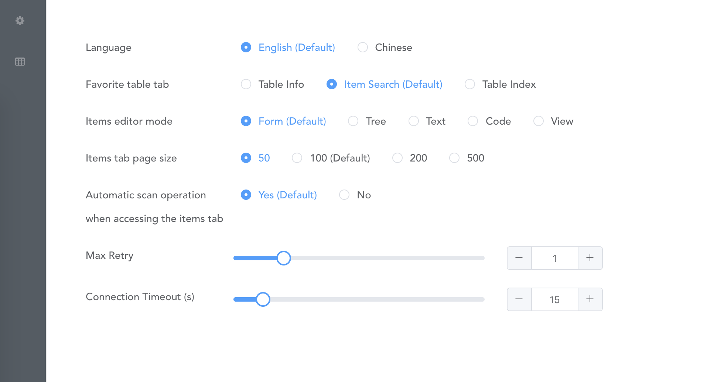
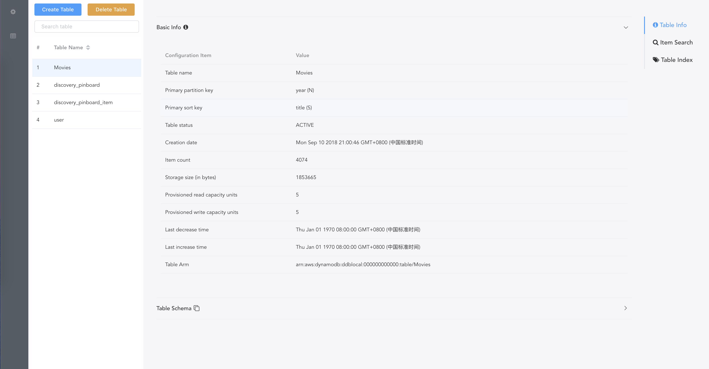
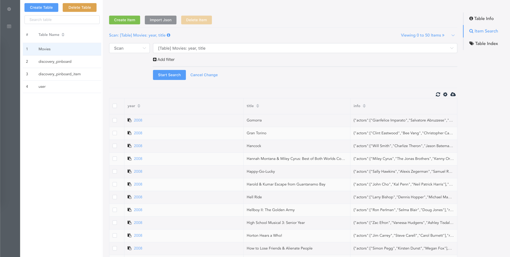
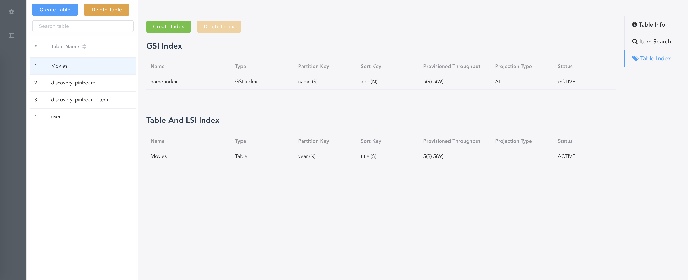

# dynamodb manager

This GUI tool to manage your local dynamodb.
If you have a better idea, welcome to issue.


## features

* Table
  * [x] Add Table
  * [x] Edit Table
  * [x] Delete Table
  * [x] Connect Table
  * [x] Add Index(GSI and LSI)
  * [x] Delete Index
* Item
  * [x] Add Item
  * [x] Edit Item
  * [x] Delete Item
  * [x] import/export Items
* Search (Table or Index)
  * [x] Scan Table
  * [x] Query Table
  * [x] Filter Condition

## how to use

~~Here is a sample website that can be used http://dynamodb.yoyadoc.com~~

*This fork was created after the original yoyadoc.com hosting expired. The site can now be found on Netlify at
https://dynamodb-manager.netlify.app*

You can also use docker to deploy the local version. https://hub.docker.com/r/taydy/dynamodb-manager/.
``` bash
docker pull taydy/dynamodb-manager
docker run -t -p 8080:80 taydy/dynamodb-manager
```
or you can build the project, and put the dist directory in amazon s3 and aliyun oss.

## show me
### setting


### config


### table info


### item search


### table index


## Build Setup

``` bash
# install dependencies
npm install

# build for production with minification
npm run build

# build image
docker build -t taydy/dynamodb-manager .

# run image
docker-compose up -d
```

## Issue
-  **applying the configuration but get error "Configuration is not in effect!"**

    please see [Cors](https://github.com/YoyaTeam/dynamodb-manager/issues/9)
